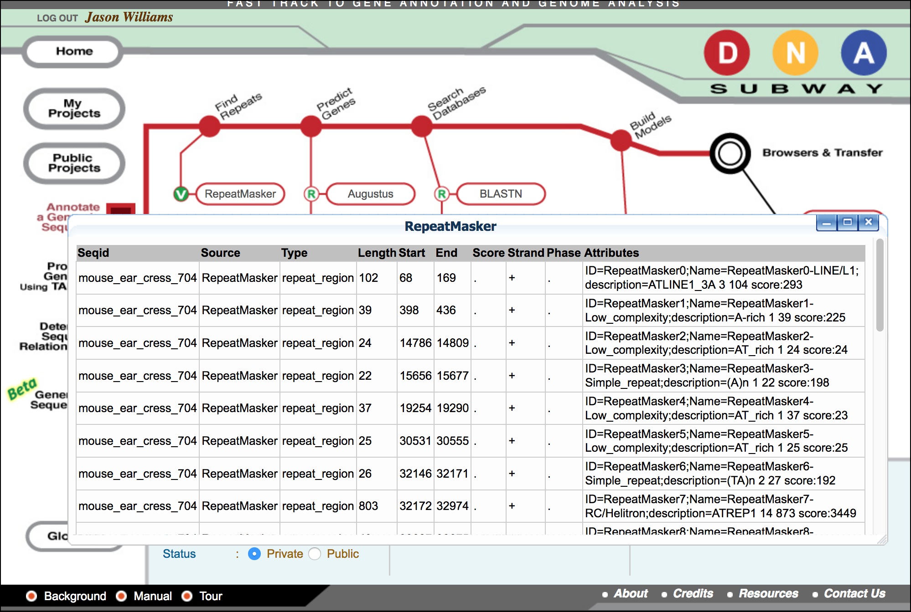
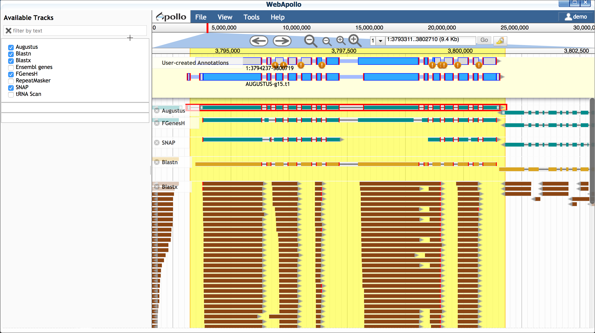

# Walkthrough of DNA Subway Red Line - Genome Annotation
Annotation adds features and information to a DNA sequence -- such as genes and their locations, structures, and functions.
A good introduction to annotation can be found in the paper [A beginner's guide to eukaryotic genome annotation](https://www.nature.com/nrg/journal/v13/n5/full/nrg3174.html).
We'll also suggest the DNA Subway's primer on [annotation evidence](https://dnasubway.cyverse.org/project/ngs/panel/1946#). 
This guide contains an explanation of basic functions for this line, as wellas exercises that might be used in the classroom.
**Some things to remember about the platform**
	@@ -205,156 +164,115 @@ as exercises that might be used in the classroom.
------------------------------------------------------------------------
## DNA Subway Red Line - Create an Annotation Project with Apollo
??? tip "transition away from Java"
    
    DNA Subway is transitioning away from the original Java-based Apollo software as most popular web browsers will no longer support Java. The new Apollo is Java-free.
1.  Log-in to [DNA Subway](https://dnasubway.cyverse.org/){target=+blank} -
    unregistered users may 'Enter as Guest'
2.  Click 'Annotate a genomic sequence.' (Red Square); select the
    'Web Apollo' version
3.  For 'Select Organism type' choose 'Animal' or 'Plant' and
    then select the appropriate subtype.
    The 'Select Organism' step will load appropriate sample
    sequences and will also adjust the models used in the de novo gene
    finding process.
    
4.  For 'Select Sequence Source' select a sample sequence.
??? tip "Apollo support"
    
    Currently, the Java-free Apollo version of Subway does not support upload of a custom DNA Sequence. 
    
    This feature is coming soon, but we will help you upload custom genomes/regions for your use in the classroom
5.  (Optional) If you have a GFF file of annotated features, you may load these import these annotations from the Green Line, or from a
    custom GFF file.
6.  Name your project and organism (required) and give a description if desired. Click 'Continue' to proceed.
### Example Exercise - Project Creation: Arabidopsis ChrI
In this and subsequent steps, we will annotate a 75KB section of Arabidopsis chromosome I.
1.  Log-in to [DNA Subway]() - unregistered users may 'Enter as Guest'.
2.  Click 'Annotate a genomic sequence.' (Red Square); select the 'Web Apollo' version.
3.  For 'Select Organism type' choose 'Plant' and then 'Dicotyledon'.
4.  from 'Select a sample sequence' chose 'Arabidopsis thaliana (mouse-ear cress) chr1, 75.00 kb'.
5.  Provide your project with a title, then Click 'Continue.'
??? tip "Sequence"
    You can view your DNA sequence by clicking the 'Sequence' link in the 'Project Information' tab at the bottom of the page.
------------------------------------------------------------------------
## DNA Subway Red Line - Find and Mask Repetitive DNA
One you have created a Red Line Project, you may begin the process of generating and assembling predictions and evidence that can be used to annotate genes.
1.  Click 'RepeatMasker'
2.  When 'RepeatMasker' turns 'green' and the icon displays a 'V' (view); click 'RepeatMasker' again to view results.
    {width="300px" height="200px"}
## **Example Exercise - Repeat Masking: Arabodopsis ChrI**
-   **Example Sequence:** Arabidopsis thaliana (mouse-ear cress) ChrI, 75 kb
-   **Tool(s):** RepeatMasker
-   **Concept(s):** Non-coding DNA, sequence repeats, mobile genetic
    elements (transposons)
Following the RepeatMasking steps for the Arabidopsis ChrI sample above, answer the following *discussion questions*:
1.  How many hits were detected in your sample?
2.  RepeatMasker reports the length of the repetitive sequences
    (Length) as well as the class (Attributes).
-   What is the average length of sequences identified as "simple
    repeats"?
-   What is the average length of sequences identified as "low
    complexity"?
3.  What is the total percentage of repetitive DNA in your sequence?
    (Sum of the length of all repetitive sequence / sequence length
    (75 kb)
??? tip "Some Useful Definitions for Repetitive Sequences"
    -  **Simple repeats:** 1-5bp repeats (e.g. repetitive dinucleotides 'AT' etc.)
    
    -  **Low Complexity DNA:** Poly-purine/ poly-pyrimidine stretches, or regions of extremely high AT or GC content.
    
    -  **Processed Pseudogenes, SINES, Retrotranscripts:** Non-functional RNAs present within genomic sequence.
    
    -  **Transposons (DNA, Retroviral, LINES):** Genetic elements which have the ability to be amplified and redistributed within a genome.
**Additional Investigation:** In the results table under 'Attributes' each repeat sequence is labeled "RepeatMasker#-XXX" The '#' is the
ordinal number of the hit, the XXX is the class of DNA element (e.g. "Simple_repeat" or "Low_complexity"). There are other types of
repetitive elements such as transposons and pseudogenes (e.g. Helitron and COPIA) Use online resources to learn more: (<http://gydb.org/index.php/Main_Page>).

------------------------------------------------------------------------

## DNA Subway Red Line - Making Gene Predictions

De novo gene predictors can be run on a sample sequence to generate
predictions of gene structure and location based solely on the sequence
nucleotides.

1.  Click on one or more gene prediction tools under the 'Gene
    Prediction' stop. to view the results table, click the gene
    predictor again once the indicator displays 'V' (view).

### Example Exercise - Predict Genes: Arabidopsis ChrI

-   **Example Sequence:** Arabidopsis thaliana (mouse-ear cress) ChrI,
    75 kb
-   **Tool(s):** Augustus, FGenesH, Snap, tRNA Scan
-   **Concept(s):** Genomic DNA, Gene Structure, Canonical sequences

Following the gene prediction steps for the Arabidopsis ChrI sample
above, answer the following *discussion questions*:

1.  Look at the 'Type' column in the gene prediction report.
    Considering the Augustus results, find the 6th gene prediction
    (hint: AUGUSTUS006;ID=g6) and then locate the first mention of the
    term 'gene' and copy down the gene's 'start' (i.e. the starting
    basepair). Note the number of times you see the term 'exon' (i.e.
    number of exons predicted).

      
    | Gene Predictor | Exon Start (bp) | Exon Stop (bp) |
    | --- | --- | --- |
    | Augustus | 23456 | 23684 |
    | Augustus |                          
    | Augustus |                         
    | Augustus |                          
    | Augustus |                          

2.  Based on the chart, did all the gene predictors yield genes
    starting at the same location? Did all the gene predictions have
    the same number of exons?
3.  Looking at the number of results returned by tRNA Scan, why are
    they so different from results made by other predictors? Are their
    places in the genome where tRNAs are more or less densely
    concentrated?

**Additional Investigation:** Look for the background link at the bottom
of the DNA Subway home page and review the section entitled 'Gene
Finding'.

------------------------------------------------------------------------

## DNA Subway Red Line - Visualize predicted genes in a Genome Browser

A genome browser is an essential tool for visualization genomic data in
context. The integrated JBrowse genome browser will allow you to see the
visualized gene predictions generated so far.

1.  Click 'JBrowse' and allow browser to load.
2.  Zoom into a region (for example, paste the region
    **1:3740638..3749063** into the location window.
        !!! Tip
                - JBrowse will load multiple tracks of data. Since the entire genome is loaded, we recommend using the 'highlight a region' feature to help keep your place. You may also wish to record the
                coordinates you are viewing as shown in the coordinates window.
                - You may also adjust the settings for a particular track by clicking on the track name.
                - Right-click on any gene to view additional details about that gene.
                {width="400px" height="250px"}
3.  Examine gene details by double-clicking on a gene to select; then
    right-click to open the 'View Details' menu.
4.  To view more tracks, click on 'Full-Screen View' in the
    upper-left of the JBrowse window to see any additional tracks
    available.

??? tip "Useful Definitions"
    **Genome Browser:** A GUI (Graphical User Interface) for viewing
    biological information. GBrowse (DNA Subway's Browser) is "designed to
    view genomes. It displays a graphical representation of a section of a
    genome, and shows the positions of genes and other functional elements.
    It can be configured to show both qualitative data such as the splicing
    structure of a gene, and quantitative data such as microarray expression
    levels." [\[citation\]](http://gmod.org/wiki/GBrowse_FAQ)

    **Track:** The individual regions of the display where information
    imported into the browser. For each type (or source) of information,
    there is usually an associated track.

### Example Exercise - Visualize predicted genes: Arabidopsis ChrI

-   **Example Sequence:** Arabidopsis thaliana (mouse-ear cress) ChrI,
    75 kb
-   **Tool(s):** Local Browser (JBrowse)
-   **Concept(s):** Gene orientation/structure, transposons, chromosome
    organization

Following the gene browser steps for the Arabidopsis ChrI sample above,
answer the following *discussion questions* (the locations of the genes
are given in parentheses and can be pasted into the browser):

*Considering the following genes:*

-   BFN1-201 (1:3748591..3753070)
-   SCAMP5-201 (1:3744556..3749035)
-   STP1-201 (1:3776366..3780845)
-   At1G11270.2 (1:3780041..3789000)

1.  Do all the gene predictors agree with each other?
2.  Which gene predictions seem to match the Ensemble genes most closely?

------------------------------------------------------------------------

## DNA Subway Red Line - Search Databases using BLAST

DNA Subway searches customized versions of UniGene and UniProt that
contain only validated plant proteins, and are free of predicted or
hypothetical proteins.

1.  Click 'BLASTN'; wait until the flashing icon displays 'V' (view)
2.  Click 'BLASTN' again to view the results.
3.  Click 'BLASTX'; wait until the flashing icon displays 'V' (view).
4.  Click 'BLASTX' again to view the results.
5.  Click on 'JBrowse' and then click 'Full-screen View' in the
    upper-left.
6.  In the 'Available Tracks' menu, add the Blastn and Blastx
    tracks.

??? tip "Useful Definitions"
        **Some Useful Definitions**
    -   **BLAST:** Basic Local Alignment Search Tool (BLAST) is an
        algorithm that search databases of biological sequence information
        (e.g. DNA, RNA, or Protein sequence) and return matches. The
        BLASTN program is specific to nucleotide data, and the BLASTX
        algorithm works with sequence data translated into amino acid
        sequences.
    -   **UniGene:** A database of transcript data, "each UniGene entry is
        a set of transcript sequences that appear to come from the same
        transcription locus (gene or expressed pseudogene), together with
        information on protein similarities, gene expression, cDNA clone
        reagents, and genomic location."
        [\[citation\]](http://www.ncbi.nlm.nih.gov/unigene)
    -   **cDNA:** DNA produced by reverse transcribing mRNA using reverse
        transcriptase. cDNAs are used to investigate mRNA within a
        biological sample.
    -   **ESTs:** "Small pieces of DNA sequence (usually 200 to 500
        nucleotides long) that are generated by sequencing either one or
        both ends of an expressed gene. The idea is to sequence bits of
        DNA that represent genes expressed in certain cells, tissues, or
        organs from different organisms."
        [\[citation\]](http://www.ncbi.nlm.nih.gov/About/primer/est.html)

### Example Exercise - Search Databases using BLAST: Arabidopsis ChrI

-   **Example Sequence:** Arabidopsis thaliana (mouse-ear cress) ChrI,
    75 kb
-   **Tool(s):** BLASTN, BLASTX, Upload Data
-   **Concept(s):** RNA, cDNAs, ESTs, Biological Databases

Following the BLAST steps for the Arabidopsis ChrI sample above, answer
the following *discussion questions* (the locations of the genes are
given in parentheses and can be pasted into the browser):

1.  Both BLASTN and BLASTX returns the 'Length' of your resulting
    matches. Do you notice differences in the average lengths of
    BLASTN and BLASTX matches? Explain.
2.  Under 'Type' both BLASTN and BLASTX returns 'match' and
    'match_part.' 'Match' is describing the overall length of a single
    match, but individual significant matches may be fragmented, i.e.
    'match_part.' Do BLASTN and BLASTX return 'match' and 'match_part'
    results in different frequencies? Explain.

------------------------------------------------------------------------

## DNA Subway Red Line - Build Gene Models using Apollo

Apollo is an extension of JBrowse which allows the user to build and
edit gene models. Apollo has a number of features but in this tutorial,
we will give brief intro covering the conceptual steps.

**A. Import Blastn model to match for transcript length** Blast searches
are matched against UniGene(blastn) and UniProt(blasts). UniGen models
are derived from cDNA and ESTs (transcriptome evidence) produced by
experiment.

1.  Open Apollo and zoom into a region of interest (e.g. **1:3793981..3802033**)
2. Ensure at least the following tracks are selected (on):
    -   Augustus (and other gene predictors: FGenesH, SNAP, etc.)
    -   Blastn
3.  Double-click on the Blastn result, and drag this transcript into
    the yellow 'User-created Annotations' section.
    {width="400px"
    height="250px"}

**B. Select a scaffold model** Use transcriptome evidence (UniGene -
BLASTN) to select the best possible gene model for a scaffold. If no
gene model exists or significantly reflects the UniGene model, use the
UniGene model itself as a scaffold.

1.  Drag a plausible model into the yellow 'User-created
    Annotations' - in this case we will choose the Augustus model;
    double-click the Augustus model to select the entire model and
    drag into 'User-created Annotations'.
2.  Adjust the Augustus model to match the 5' and 3' configuration
    of the blastn model
    -   Delete the extraneous 5' exon (single-click to select;
        right-click to delete)
    -   Adjust the new 5' end to match the length of the blastn-derived
        transcript
    -   Adjust the 3' end of the Augustus-derived model (single-click
        to select; use your cursor/mouse to adjust the model length) {width="420px" height="250px"}

**C. Edit model for splice sites and variants** Protein and EST data can
be used to examine possible alternative transcripts. Proteins give clues
to the actual length of the translated protein at that locus and its
reading frame. Like full length cDNAs, ESTs give valuable information on
transcript diversity. ESTs are generated by high throughput methods, and
although the data may be fragmentary, it may capture biologically
relevant information about splice variants.

1.  Turn on the blastx track

2.  Examine the additional evidence to consider making adjustments to
    your Augustus-derived model. If you wish to make additional
    isoforms of your gene:
    -   Double-click to select the entire Augustus-derived model
    -   Right-click on the model to duplicate
    -   Make adjustments to the model as desired 
    {width="420px" height="250px"}

You also have the option of adding additional [EST evidence](https://en.wikipedia.org/wiki/Expressed_sequence_tag). For the Arabodopsis 75KB section, we have prepared a selection of EST data. You
will need to **close Apollo to load this data**.

1.  Download the Arabidopsis ESTs for this region to your computer
    from [this link](https://de.cyverse.org/dl/d/A9BED6DE-83F3-4F38-A3FE-0AA0A9AF5D53/EST_Chr1_3729956..3804955.fasta)
2.  Click on 'Upload Data'; under "Add DNA data in FASTA format"
    upload the EST file from the link in step 1.
3.  Click on 'User BLASTN' to align the ESTs to this section of the
    Arabidopsis genome
4.  Open 'Web Apollo'. The "Blastn User" track should be loaded.
    You may move this track to a convenient position on the browser
    {width="420px" height="280px"}

While EST evidence is always incomplete, these sequences can help you
determine features of the gene model.

??? tip "Learn More about Gene Evidence"
    -   J.Craig Venter on [ESTs](http://dnaftb.dev.dnalc.org/39/av-2.html)
    -   "Dynamic Gene" [Evidence animation](http://dynamicgene.dnalc.org/evidence/evidence.html) (requires Flash)

**D. Determine translation start/stop sites** After making your
adjustments, you can confirm that your gene model(s) represents the
longest possible transcripts:

1.  Double-click the model; right-click and select 'Set longest ORF'

**E. Compare gene model(s) with existing annotations** After making your
gene models you can compare them with existing annotations by turning on
the 'Ensemble genes' track. In this case, our work confirms the first
gene model made, but a potential isoform supported by blastx data is
likely incorrect.

{width="420px" height="150px"}

### **Example Exercise - Build Gene Models using Apollo: Arabodopsis ChrI**

-   **Example Sequence:** Arabidopsis thaliana (mouse-ear cress) ChrI,
    75 kb
-   **Tool(s):** Apollo
-   **Concept(s):** Synthesizing multiple lines of evidence

Following the Apollo steps for the Arabidopsis ChrI sample above, answer
the following *discussion questions* (the locations of the genes are
given in parentheses and can be pasted into the browser):

1.  Try annotation of the following genes and take notes on your
    annotation ( right-click on the gene model, open the 'Information
    Editor' and scroll down to the comments section to enter
    comments). How do your annotations compare with the Ensembl
    annotations?
    *Genes to try:*
    -   AT1G11270.2 (1:3781511..3790520)
    -   STP1-201 (1:3776261..3785270)
    -   T28P6.11-201 (1:3762877..3764678)

------------------------------------------------------------------------

**Fix or improve this documentation**

-   Search for an answer: [CyVerse Learning Center](https://cyverse-learning-materials.github.io/learning-materials-home)
-   Ask us for help: click the Intercom icon { width="25" } on the lower right-hand side of the page
-   Report an issue or submit a change: [Github Repo](https://github.com/CyVerse-learning-materials/learning-materials-home/edit/mkdocs/docs/dna_subway_guide)
-   Send feedback: [learning@CyVerse.org](learning@CyVerse.org)

------------------------------------------------------------------------