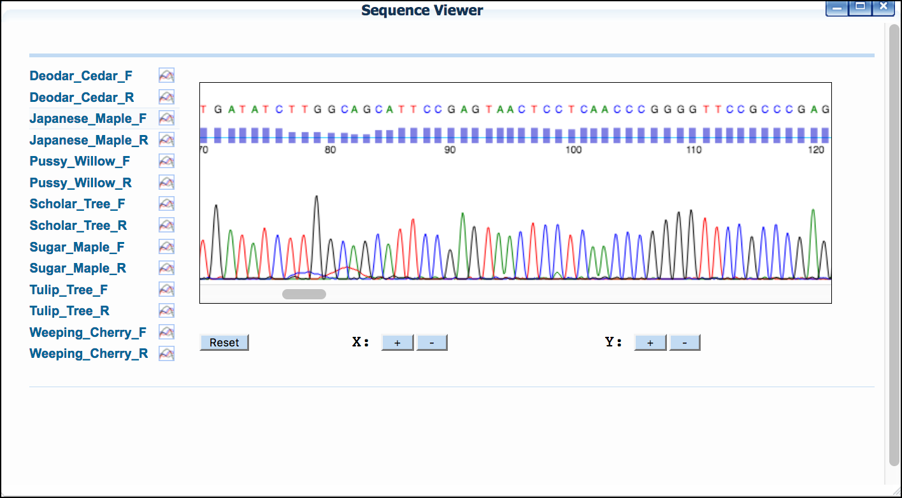

# Walkthrough of DNA Subway Blue Line - DNA Barcoding and Phylogenetics

You can analyze relationships between DNA sequences by comparing them to
a set of sequences you have compiled yourself, or by comparing your
sequences to other that have been published in database such as GenBank
(National Center for Biotechnology Information). Generating a
phylogenetic tree from DNA sequences derived from related species can
also allow you to draw inferences about how these species may be
related. By sequencing variable sections of DNA (barcode regions) you
can also use the Blue Line to help you identify an unknown species, or
publish a DNA barcode for a species you have identified, but which is
not represented in published databases like GenBank.

**Some things to remember about the platform**

-   Wet lab protocols and other resources are available at
    <http://dnabarcoding101.org/>
-   The DNA Barcoding 101 site also contains information on low-cost
    sequencing for U.S.-based educators.

------------------------------------------------------------------------

!!! Warning "Sample Data"

        **How to use provided sample data**

        In this guide, we will use a mosquito dataset that includes DNA
        sequences isolated from mosquito larvae collected from Virginia's
        Shenandoah Valley (*"Mosquito dataset"*). There is a complete
        two-hour classroom bioinformatics lab with detailed instructions for
        instructors and students on QUBES hub
        [here](https://qubeshub.org/qubesresources/publications/165/2). Where
        appropriate, a note (in this orange colored background) in the
        instructions will indicate which options to select to make use of this
        provided dataset.

        **Sample data citation**: Williams, J., Enke, R. A., Hyman, O.,
        Lescak, E., Donovan, S. S., Tapprich, W., Ryder, E. F. (2018). Using
        DNA Subway to Analyze Sequence Relationships. (Version 2.0). QUBES
        Educational Resources.
        [doi:10.25334/Q4J111](http://dx.doi.org/10.25334/Q4J111)

        **Video Course**

        Here is a video series on analyzing data with DNA Subway using the
        above mosquito dataset and lesson:

        <iframe width="560" height="315" align="center" src="https://www.youtube.com/embed/videoseries?list=PLRosqf3DDcTFqyPDG04Ed9EjrjaC_UTQo" frameborder="0" allow="accelerometer; autoplay; encrypted-media; gyroscope; picture-in-picture" allowfullscreen></iframe>

!!! Tip

        See a Course Source paper with protocols and recommendations for
        implementing a Barcoding CURE (course-based undergraduate research
        experience): [CURE-all: Large Scale Implementation of Authentic DNA Barcoding Research into First-Year Biology Curriculum](https://www.coursesource.org/courses/cure-all-large-scale-implementation-of-authentic-dna-barcoding-research-into-first-year).

## *DNA Subway Blue Line - Create a Barcoding Project*

1. Log-in to [DNA Subway](https://dnasubway.cyverse.org/) - unregistered users may 'Enter as Guest'
    !!! Note
        Only registered users submitting novel, high-quality sequences
        will be able to submit sequence to GenBank
2. Choose a project type:  
    **-**   Phylogenetics: build phylogenetic trees from any DNA, protein, or mtDNA sequence)  
    **-**   Barcoding: DNA Barcoding for plants (rbcL), animals (COI), bacteria (16S), and fungi (ITS)
    !!! Warning "Sample Data"
            
            *"Mosquito"* dataset: Select **COI**.
3. Under 'Select Sequence Source' select a sequence buy uploading
    either a FASTA file or AB1 Sanger sequencing tracefile; pasting in
    a sequence in FASTA format, or selecting and importing a trace
    file from DNALC. If you do not have a file, you may select any of
    the available sample sequences.
    !!! Warning "Sample Data"
            
            *"Mosquito"* dataset:
            From **Select a set of sample sequences** select **Intro to Barcoding Bioinformatics: Mosquitoes**.
4.  Name your project, and give a description if desired; click 'Continue.'

------------------------------------------------------------------------

## DNA Subway Blue Line - View and Clean Barcoding Sequence Data

**A. View Sequencing Trace File**

If you provided AB1 trace files, or imported files from DNALC, you will
be able to view the sequence electropherogram.

1.  Click 'Sequence Viewer' to show a list of your sequences.
2.  Click on a sequence name to show the sequences' trace file.

{width="400px" height="200px"}

**B. Trim sequence, reverse complement and pair**

By default, DNA Subway assumes that all reads are in the forward
orientation, and displays an 'F' to the right of the sequence. If any
sequence is not in that orientation, click the "F" to reverse compliment
the sequence. The sequence will display an "R" to indicate the change.

1.  Click 'Sequence Trimmer.'
2.  Click 'Sequence Trimmer' again to examine to changes made in the sequence
3.  Click 'Pair Builder.'
4.  Select the check boxes next to the sequences that represent bidirectional reads of the same sequence set. Alternatively Select the 'Auto Pair' function and verify the pairs generated.
    !!! Warning "Sample Data"

            *"Mosquito"* dataset:
            Click **Try Auto Pairing**. One pair of horsefly sequences and 4
            pairs of mosquito sequences will be created. Finally, click
            `Save`{.interpreted-text role="guilabel"}.
5.  As necessary, Reverse Compliment sequences that were sequenced in
    the reverse orientation by clicking the 'F' next to the sequence
    name. The 'F' will become an 'R' to indicate the sequence has been
    reverse complimented.
6.  Click `Save`{.interpreted-text role="guilabel"} to save the created pairs.

**C. Build a consensus sequence** This step remove poor quality areas at
the 5' and/or 3' ends of the consensus sequence.

1.  Click on "Trim Consensus." Once the job is ready to view, click
    \"Trim Consensus\" again to view the results. Scroll left and
    right in the consensus editor window to identify what string of
    nucleotides from the consensus sequence you want to trim.
2.  Click on the last consensus sequence nucleotide that you want to
    trim. A red line will indicate what nucleotides will be removed
    from the consensus sequences.
3.  Click `Trim`{.interpreted-text role="guilabel"}. A new "Consensus
    Editor" window will pop up displaying the trimmed sequences.
    
    !!! Warning "Sample Data"

            *"Mosquito"* dataset: All of the sequences in this dataset benefit from trimming. Follow the steps above to trim sequences. We recommending trimming at the first and last "grey" (lower quality) nucleotide on the right and left ends.

------------------------------------------------------------------------

## DNA Subway Blue Line - Find Matches with BLAST

DNA Subway Blue Line will search a local copy of a BLAST databases to
check for published matches in GenBank.

!!! Tip
        At the end of the BLAST results page, you can see the latest update to the DNA Subway BLAST database.

1.  Click 'BLASTN\' then click the \'BLAST\' link to BLAST the
    sequence of interest. When the search is completed a \'View\' link
    will appear.
2.  Examine the BLAST matches for candidate identification. Clicking
    the species name given in the BLAST hit will also give additional
    information/photos of the listed species.
3.  If desired, select the check box next to any hit, and click
    `&Add BLAST hits to project`{.interpreted-text role="guilabel"} to
    add selected sequences to your project.
    {width="400px" height="200px"}

    !!! Warning "Sample Data"

            *"Mosquito"* dataset: We recommend performing a BLASTN search for all samples and saving the top 2 matches to your project for additional analysis (as in Step 3).

------------------------------------------------------------------------

## DNA Subway Blue Line - Add Reference Data

Depending on the project type you have created, you will have access to
additional sequence data that may be of interest. For example, if you
are doing a DNA barcoding project using the rbcL gene, samples of rbcL
sequence from major plant groups (Angiosperms, Gymnosperms, etc.) will
be provided. Choose any data set to add it to your analysis; you will be
able to include or exclude individual sequences within the set in the
next step.

1.  Click 'Reference Data.'

2.  Select sequences of your choice.
3.  Click `&Add ref data`{.interpreted-text role="guilabel"} to add
    the data to your project.
    
    !!! Warning "Sample Data"

            *"Mosquito"* dataset: Select **Common insects** and then click `&Add ref data`{.interpreted-text role="guilabel"}.

------------------------------------------------------------------------

## DNA Subway Blue Line - Build a Multiple Sequence Alignment and Phylogenetic Tree

**A. Build a multiple sequence alignment and phylogenetic tree**

1.  Click 'Select Data.'
2.  Select any and all sequences you wish to add to your tree.
    !!! Warning "Sample Data"

            *"Mosquito"* dataset: We suggest first adding your \"user data\" and building an alignment and tree. You can return to this step later to build additional trees. Once Selected, click `&Save Selections`{.interpreted-text role="guilabel"}. Follow the rest of the steps in this section and section B to create your tree.
3.  Click `&Save Selections`{.interpreted-text role="guilabel"} to select data
4.  Click 'MUSCLE.' to run the MUSCLE program.
5.  Click 'MUSCLE' again to open the sequence alignment window.
    {width="400px" height="200px"}
6.  Examine the alignment and then select the `&Trim Alignment`{.interpreted-text role="guilabel"} button in the upper-left of the Alignment viewer\'

**B. Build phylogenetic tree**

1.  Click \'PHYLIP NJ\' and then click again to examine a
    neighbor-joining tree
    {width="400px" height="200px"}

2.  Click \'PHYLIP ML\' and then click again to examine a
    maximum-likelihood tree
    {width="400px" height="200px"}

    !!! Warning "Sample Data"

            *"Mosquito"* dataset: We suggest setting "horsefly" as outgroup for both trees.

------------------------------------------------------------------------

**Fix or improve this documentation**

-   Search for an answer: [CyVerse Learning Center](https://cyverse-learning-materials.github.io/learning-materials-home)
-   Ask us for help: click the Intercom icon { width="25" } on the lower right-hand side of the page
-   Report an issue or submit a change: [Github Repo](https://github.com/CyVerse-learning-materials/learning-materials-home/edit/mkdocs/docs/dna_subway_guide)
-   Send feedback: [learning@CyVerse.org](learning@CyVerse.org)

------------------------------------------------------------------------