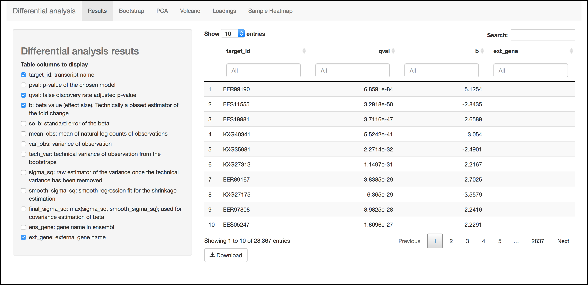
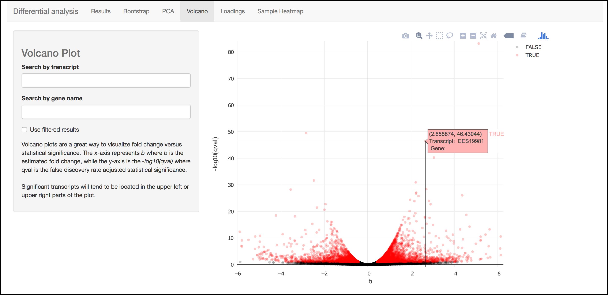

# Walkthrough of DNA Subway Green Line: Kallisto/Sleuth RNA-Seq

The Green Line runs within CyVerse DNA Subway and leverages powerful
computing and data storage infrastructure and uses the supercomputer
cluster to provide a high performance analytical platform with a simple
user interface suitable for both teaching and research. is a quick,
highly-efficient software for quantifying transcript abundances in an
RNA-Seq experiment. Even on a typical laptop, Kallisto can quantify 30
million reads in less than 3 minutes. Integrated into CyVerse, you can
take advantage of CyVerse DNA Subway to process your reads, do the
Kallisto quantification, and analyze reads with the Kallisto companion
software in an R-Shiny app.

**Some things to remember about the platform**

-   You must be a registered CyVerse user to use Green Line.
-   The Green Line was designed to make RNA-Seq data analysis
    "simple". However, we ask that users thoughtfully decide what
    "jobs" they want to submit. **Each user is limited to a maximum of
    4 concurrent jobs running on Green Line**.
-   A single Green Line project may take a week to process since HPC
    computing is subject to queues which hundreds of other jobs may be
    staging for. Additionally these systems undergo regular maintenance
    and are subject to periodic disruption.

!!! Note
    
    **New, faster Green Line**
    
    Green Line is now running on [Jestream Cloud](https://jetstream-cloud.org/). This should greatly reduce queue times (The entire running time for this tutorial is about 60
    minutes). We have designed Green Line for a lower number of
    concurrent users (<50), and still recommend teaching using jobs
    you have made public, and only running the entire workflow when
    you are working with novel data. Please let us know about your
    experience: [send feedback](https://dnasubway.cyverse.org/feedback.html).
    
    <iframe width="560" height="315" align="center" src="https://www.youtube.com/embed/XLBpway_jG8" frameborder="0" allow="accelerometer; autoplay; encrypted-media; gyroscope; picture-in-picture" allowfullscreen></iframe>

!!! Danger "Important: Discontinued Support for Tuxedo Workflow"
    
    The Tuxedo workflow previously implemented for the Green Line will
    has been removed in **June 2019**. Data and previously analyzed results will still be available on the CyVerse Data Store, however it is not possible to execute new analyses which include Tuxuedo.

------------------------------------------------------------------------

!!! Warning "Sample Data"
        
        **How to use provided sample data**

        In this guide, we will use an RNA-Seq dataset (*"Zika infected
        hNPCs"*). This experiment compared human neuroprogenetor cells
        (hNPCs) infected with the Zika virus to non-infected hNPCs. You can
        read more about the experimental conditions and methods in this [reference](https://journals.plos.org/plosone/article?id=10.1371/journal.pone.0175744).
        Where appropriate, a note (in this orange colored background) in the
        instructions will indicate which options to select to make use of this
        provided dataset.

        **Sample data citation**: Yi L, Pimentel H, Pachter L (2017) Zika
        infection of neural progenitor cells perturbs transcription in
        neurodevelopmental pathways. PLOS ONE 12(4): e0175744. [reference](https://journals.plos.org/plosone/article?id=10.1371/journal.pone.0175744).

        **Video Course**

        Here is a video series on analyzing data with DNA Subway using the above Zika dataset and lesson:

        <iframe width="560" height="315" align="center" src="https://www.youtube.com/embed/videoseries?list=PLRosqf3DDcTHLTsiCTT8tnA2ZAfMM5AWb" frameborder="0" allow="accelerometer; autoplay; encrypted-media; gyroscope; picture-in-picture" allowfullscreen></iframe>

## DNA Subway Green Line: Kallisto/Sleuth - Create an RNA-Seq Project to Examine Differential Abundance

**A. Create a project in Subway**

1.  Log-in to - unregistered users may NOT use Green Line.
2.  Click on the Green "Next Generation Sequencing" square to start
    a Green Line project.
3.  For 'Select Project Type' select either "Single End Reads" or
    "Paired End Reads".

    !!! Warning "Sample Data"
            
            *"Zika infected hNPCs"* dataset: Select **Paired End Reads**

4\.  For 'Select an Organism' select a species and genome build.

!!! Warning "Sample Data"
        
        *"Zika infected hNPCs"* dataset: Select **Homo sapiens - Ensembl 78 GrCh38**

5\.  Enter a project title, and description; click 'Continue'.

!!! Tip

        If you don't see a desired species/genome [contact us](https://dnasubway.cyverse.org/feedback.html) to have it added.

**B. Upload Read Data to CyVerse Data Store** The sequence read files
used in these experiments are too large to upload using the Subway
internet interface. You must upload your files (either .fastq or
.fastq.gz) directly to the CyVerse Data Store.

1.  Upload your reads to the CyVerse Data Store using Cyberduck. See instructions: [Data Store Guide](https://cyverse-learning-materials.github.io/learning-materials-home/ds/intro/).

!!! Note
        This step is not directly connected with DNA Subway. You can use any data uploaded to the CyVerse Data Store.

!!! Warning "Data Limit"
        There is a limit of 6GB per file for samples on Green Line. For larger file sizes, you may wish to use the Kallisto tools in the CyVerse Discovery Environment. See the for more information.

------------------------------------------------------------------------

## DNA Subway Green Line: Kallisto/Sleuth - Manage Data and Check Quality with FASTQC

**A. Select and pair files**

1.  Click on the "Manage Data" step: this opens a Data store window
    that says "Select your FASTQ files from the Data Store" (if you
    are not logged in to CyVerse, it will ask you to do so).
2.  Click on the folder that matches your CyVerse username and
    Navigate to the folder where your sequencing files are located.

    !!! Warning "Sample Data"
            
            *"Zika infected hNPCs"* dataset: Select **Sample Data**.

3.  Select the sequencing files you want to analyze (either .fastq or .fastq.gz format).

    !!! Warning "Sample Data"
            
            *"Zika infected hNPCs"* dataset: You will be presented with the following 8 files; **check-select all of the files** and click the `+ Add files`{.interpreted-text role="guilabel"} button:

         -   SRR3191542_1.fastq.gz
         -   SRR3191542_2.fastq.gz
         -   SRR3191543_1.fastq.gz
         -   SRR3191543_2.fastq.gz
         -   SRR3191544_1.fastq.gz
         -   SRR3191544_2.fastq.gz
         -   SRR3191545_1.fastq.gz
         -   SRR3191545_2.fastq.gz
         
         The SRR3191542 and SRR3191543 files are 2 replicates (paired-end) of the uninfected cells and the SRR3191544 and SRR3191545 file are from the Zika infected cells.

4.  If working with paired-end reads, click the `Pair Mode OFF`{.interpreted-text role="guilabel"} button to toggle to on; check each pair of sequencing files to pair them.

    !!! Warning "Sample Data"
            
            *"Zika infected hNPCs"* dataset: Right reads end in "_1" and left reads end in "_2". **Click the** `Pair Mode OFF`{.interpreted-text role="guilabel"} **button** to turn pairing on, and **check-select each of the paired samples** (e.g. SRR3191543_1.fastq.gz and SRR3191543_2.fastq.gz).

**B. Check sequencing quality with FastQC**

It is important to only work with high quality data. is a popular tool
for determining sequencing quality.

!!! Tip
        
        This step takes place in the same **Manage data** window as the steps above.

1. Once files have been loaded, in the 'Manage Data' window, click the 'Run' link in the 'QC' column to run FastQC.

    !!! Note

            There is a limit of 4 concurrent jobs. These jobs should take less
            than 20 minutes to complete (depending on file size) and you may need
            to let several jobs finish before proceeding. If you have previously
            processed reads for quality, you can skip the FastQC step.

2\.  One the jobs are complete, click the 'View' link to view the results.

!!! Tip

    You can see a description and explanation of the FastQC report on the CyVerse Learning Center and a more detailed set of explanations on the website.

------------------------------------------------------------------------

## DNA Subway Green Line: Kallisto/Sleuth - Trim and Filter Reads with FastX Toolkit

Raw reads are first "quality trimmed" (remove poor quality bases off
the end(s) of a read) and then are "quality filtered" (filter out
entire poor quality reads) prior to aligning to the transcriptome. After
trimming and filtering, FastQC is run on the trimmed/filtered files.

1.  Click "FastX ToolKit" to open the FastX Toolkit panel for all your data.

2.  For each file, under 'Basic', Click 'Run' to filter the reads using default parameters or click 'Advanced' to run with desired parameters; repeat this process for all the FASTQ files in your dataset.

    !!! Warning "Sample Data"
            
            *"Zika infected hNPCs"* dataset: The quality of the reads in this dataset is relatively good. You can **skip the FastX Toolkit step for this dataset**.

    !!! Tip
            The 'Basic' setting for FastX Toolkit uses the same settings as
            the defaults in the 'Advanced' run:

         -   **quality_trimmer: minimum quality**: 20
         -   **quality_trimmer: minimum trimmed read length**: 20
         -   **quality_filter: minimum quality**: 20
         -   **quality_filter: minimum quality**: 50

3.  Once the job completes, click the 'View' link to view a generated FastQC report.
4.  Since you may trim reads multiple times to achieve the desired quality of data record the job IDs (e.g. fx####) that you wish to use in the subsequent steps.

------------------------------------------------------------------------

## DNA Subway Green Line: Kallisto/Sleuth - Quantify reads with Kallisto

Kallisto uses a 'hash-based' pseudo alignment to deliver extremely fast
matching of RNA-Seq reads against the transcriptome index (which was
selected when you created your Green Line project). A Kallisto analysis
must be run for each mapping of RNA-Seq reads to the index. In this
tutorial, we have 12 fastQ files (6 pairs), so you will need to launch 6
Kallisto analyses.

??? tip "The Science Behind Kallisto"
        You can find a detailed video series on the science behind the Kallisto software and pseudoalignment: [YouTube](https://www.youtube.com/playlist?list=PL-0S9LiUi0vhjynujVZw34RKmUo6vPmVd).

1.  Click the "Quantification" step and enter a sample and condition name for each of your samples. You will typically have several replicates (at least 3 minimum) for each sample. For your condition, our implementation of the Kallisto/Sleuth workflow supports **two conditions**.

    !!! Danger "Warning"
            When naming your samples and conditions, avoid spaces and special
            characters (e.g. !#\$%\^&/, etc.). Also be sure to be consistent with spelling.

    !!! Warning "Sample Data"
            
            *"Zika infected hNPCs"* dataset:  
            We suggest the following names for this dataset:

            | Left/Right Pair | Sample name | Condition |
            | --- | --- | --- |
            | SRR3191542_1.fastq.gz   SRR3191542_2.fastq.gz | Mock1-1 | Mock |
            | SRR3191543_1.fastq.gz   SRR3191543_1.fastq.gz | Mock2-1 | Mock |
            | SRR3191544_1.fastq.gz   SRR3191544_2.fastq.gz | ZIKV1-1 | Zika |
            | SRR3191545_1.fastq.gz   SRR3191545_2.fastq.gz | ZIKV2-1 | Zika |

2.  After naming the samples and conditions, click the `Submit`{.interpreted-text role="guilabel"} button to submit a job. Typically, within \~1 minute you will be provided with a job number. The job will be entered into the queue at the TACC Stampede supercomputing system. You can come back and click the Quantification stop to see the status of the job. The indication for the quantification stop will show "R" (running) while the job is running.
    
    !!! Warning "Sample Data"
            
            *"Zika infected hNPCs"* dataset: Under parameters **uncheck** the *Build pseudo-bam files* option.

!!! Tip

        You can select some of the advanced options for your Kallisto job by clicking the "Parameters" link in the Quantification stop. See more about these advanced parameters in the [Kallisto manual](https://pachterlab.github.io/kallisto/manual).

------------------------------------------------------------------------

## DNA Subway Green Line: Kallisto/Sleuth- Visualize data using IGV

In the "View Results" steps you have access to alignment
visualizations, data download, and interactive visualization of your
differential expression results.

1.  Click the "View results" step and choose one of the following
    options:

**IVG - Integrated Genome Viewer**

!!! Tip

        IGV visualization will only be possible if you have built pseudo-bam
        files in the Kallisto step.

Click the icon in the "IGV" column to view a visualization of
your reads pseudoaligned to the reference transcriptome. You will need
to click the `Make it public`{.interpreted-text role="guilabel"}
button (and possibly be re-directed to the CyVerse Discovery
Environment). After making the data "public" which allows DNA Subway
to access your files on the CyVerse Data Store, you must also select a
memory size to launch this Java application. If you are not sure of
which value to select, use the default 750MB option.

!!! Warning

        Using IGV requires Java software. Java is increasingly unsupported for
        security reasons on the internet.

    !!! Tip "Java Help"
            Java must be available and enabled in your Internet browser to use the
            IGV function. Java frequently is the source of security
            vulnerabilities and so its not uncommon to experience configuration
            issues due to safety. Follow the tips below to configure Java for your
            computer. Alternatively, you can use the Download link (see
            instructions in the section below) to download your data (you will
            need the .bam and .bam.bai files) and download and install yourself.

            *Internet Browser*

            We highly recommend using Firefox as your browser for DNA Subway.  
            -   Verify your Java availability for your browser: [Java test](https://www.java.com/en/download/installed.jsp)  
            -   Java must be [enabled](https://java.com/en/download/help/enable_browser.xml) in your browser

            *Java Configuration*

            -   Open the Java control panel on your computer. (On Mac, open System
                Preferences > Java. On PC, open Control Panel > Programs >
                Java.)  
            -   Click the Security tab and check "Enable Java in the browser"
                and set the security level for applications to "high". Add
                "<http://dnasubway.cyverse.org>" and "<http://gfx.dnalc.org>"
                to the "Exception Site List" in the Java Security tab.

**Download Data - Abundance**

Click the folder icon to be redirected to the CyVerse Discovery
Environment (you may be required to log in). You will be directed
to all outputs from you Kallisto analysis. You may preview them in
the Discovery Environment or use the path listed to download the
files using Cyberduck (see [Data Store Guide](https://cyverse-learning-materials.github.io/learning-materials-home/ds/intro/)). A tab-separated file of abundances
for each sequence pair is available at the download link.

------------------------------------------------------------------------

## DNA Subway Green Line: Kallisto/Sleuth- Visualize data using Sleuth

**Differential analysis - Shiny App**

Click the "Sleuth R Shiny" link to launch an interactive window which contains data and graphics from your analysis.

**R Shiny App Walkthrough**

The R Shiny App allows you to explore your differential expression
results as generated by the . We will cover highlights to for each
menu in the app.

??? tip "Data Transfer Timings"
    It can take a few minutes for data to be transferred to the R
    Shiny server after the quantification step completes. If R Shiny
    does not load, try again in a few minutes. If you still have an
    issue, use the link and include your project number in the
    feedback form.

**Results Menu**

{width="800px" height="400px"}

This menu is an interactive table of your results. You can choose
which columns to display in the table using the checkboxes on the
left of the screen. Several important values selected by default
include:

- **Target_id**: This is the name of the transcript (gene) from the selected reference transcriptome.
- **qval**: This is a corrected (for multiple testing) p-value indicating the significance test of differential abundance. Lower numbers indicate greater significance.
- **b**: This is an estimate of the fold change between the conditions
- **ext_gene**: If available, these are gene names pulled from Ensemble

!!! Tip

        Click the `Download`{.interpreted-text role="guilabel"} button to download these results.

**Bootstrap**

{width="800px" height="400px"}

This menu will display a box plot that indicates the difference in
expression between conditions. The box plots themselves indicate
variation between replicates as estimated by bootstrap sampling of
the reads. A dropbox enables you to select any transcript.
Clicking the "Show genes" will load alternative gene names if
available.

!!! Tip

        Right-click a graph to download this and other images.

**PCA**

{width="800px" height="400px"}

This graph displays principle components of each of the
conditions/replicates. In general replicates of the same condition
should cluster closely together.

**Volcano Plot**

{width="800px" height="400px"}

This scatter plot displays all transcripts colored by significance
of differential abundance. You may also use menu on the left of
the screen to highlight specific genes/transcripts or previously
set filters from the results menu.

**Loadings**

{width="800px" height="400px"}

This barplot indicates which genes/transcripts explain most of the variance computed in the principle components analysis.

**Heatmap**

{width="800px" height="400px"}

This heatmap gives a measure of the similarity between the possible comparison of the samples and their replicates.

------------------------------------------------------------------------

**Summary**: Together, Kallisto and Sleuth are quick, powerful ways to
analyze RNA-Seq data.

------------------------------------------------------------------------

**Fix or improve this documentation**

-   Search for an answer: [CyVerse Learning Center](https://cyverse-learning-materials.github.io/learning-materials-home)
-   Ask us for help: click the Intercom icon { width="25" } on the lower right-hand side of the page
-   Report an issue or submit a change: [Github Repo](https://github.com/CyVerse-learning-materials/learning-materials-home/edit/mkdocs/docs/dna_subway_guide)
-   Send feedback: [learning@CyVerse.org](learning@CyVerse.org)

------------------------------------------------------------------------