.. include:: cyverse_rst_defined_substitutions.txt
|CyVerse_logo|_

|Home_Icon|_
`Learning Center Home <http://learning.cyverse.org/>`_

Walkthrough of DNA Subway Purple Line (beta testing documentation)
---------------------------------------------------------------------

.. warning::

  **Beta Release:**
  Purple line is in beta release. Please send feedback to
  `DNALC Admin <mailto:dnalcadmin@cshl.edu>`_


The Purple Line provides the capability for analysis of microbiome and eDNA
(environmental DNA) by implementing a simplified version of the
|QIIME 2| (pronounced "chime two") workflow. Using the
Purple Line, you can analyze uploaded high throughput sequencing reads to
identify species in microbial or environmental DNA samples.

Metabarcoding uses high-throughput sequencing to analyze hundreds of thousands
of DNA barcodes from complex mixtures of DNA. In a typical experiment, DNA is
isolated from sterile swabs or material taken from different environmental
locations or conditions. PCR is used to amplify a variable region, such as COI,
or 12S or 16S ribosomal RNA genes, and sequence reads identify the variety and
abundance of species from different samples. The analysis requires specialized
software, such as QIIME 2.

The Purple Line integrates sequence data and metadata imported from CyVerse's
Data Store, demultiplexing of samples, quality control, and taxonomic
identification and quantitation. Once sequences are analyzed, the results can be
visualized to allow comparisons between samples and different conditions
summarized in the metadata.


**Some things to remember about the platform**

- You must be a registered CyVerse user to use Purple Line (register for a
  CyVerse account at |CyVerse User Portal| )
- The Purple line was designed to make microbiome/eDNA data analysis "simple".
  However, we ask that users very carefully and thoughtfully decide what "jobs"
  they want to submit.
- A single Purple Line project may take hours to process since
  HPC computing is subject to queues which may support hundreds of other jobs.
  These systems also undergo regular maintenance and are subject to
  periodic disruption.
- DNA Subway implements the |QIIME 2| software. This software is in continual
  development. Our version may not be the most current, and our documentation
  and explanation is not meant to replace the full |QIIME2 documentation|.
- We have made design decisions to create a straightforward classroom-friendly
  workflow. While this Subway Line does not have all possible features of QIIME
  2, we purpose to cover important concepts behind microbiome and eDNA analysis.


----

     .. admonition:: Sample data

      **How to use provided sample data**
      In this guide, we will use a microbiome dataset (*"ubiome-test-data"*)
      collected from various water sources in Montana (down-sampled and de-
      identified).Where appropriate, a note (in this orange colored background)
      in the instructions will indicate which options to select to make use of
      this provided dataset.


*DNA Subway Purple Line - Metadata file and Sequencing Prerequisites*
~~~~~~~~~~~~~~~~~~~~~~~~~~~~~~~~~~~~~~~~~~~~~~~~~~~~~~~~~~~~~~~~~~~~~~~

If you are generating data for a project (i.e. sequencing samples), you will
need to provide the sequencing data (fastq files) as well as a metadata file
that describes the data contained in these sequencing files. This metadata
must conform to strict guidelines, or analyses will fail. QIIME 2 metadata is
stored in a TSV (tab-separated values) file. These files typically have a .tsv
or .txt file extension, though it doesn't matter to QIIME 2 what file extension
is used. TSV files are simple text files used to store tabular data, and the
format is supported by many types of software, such as editing, importing, and
exporting from spreadsheet programs and databases. Thus, it's usually
straightforward to manipulate QIIME 2 metadata using the software of your
choosing. If in doubt, we recommend using a spreadsheet program such as
Microsoft Excel or Google Sheets to edit and export your metadata files.

**Handling Project Metadata**

Before you create your project, you will have generated metadata (as described
above) for your project. You have two options for preparing this metadata to
ensure that it conforms to the required QIIME2 parameters. The file must be
validated (which you can do on your own or using Subway). If there are errors
in your file (this is common), they must be fixed.


  .. tip::

    Here are a few reminders for formatting your metadata.

    **Leading and trailing whitespace characters**

    If any cell in the metadata contains leading or trailing whitespace
    characters (e.g. spaces, tabs), those characters will be ignored when the
    file is loaded. Thus, leading and trailing whitespace characters are not
    significant, so cells containing the values 'gut' and '  gut  ' are
    equivalent. This rule is applied before any other rules described below

    **ID column**

    The first column MUST be the ID column name (i.e. ID header) and the
    first line of this column should be #SampleID or one of a few alternative.

        - Case-insensitive: id; sampleid; sample id; sample-id; featureid;
          feature id; feature-id.
        - Case-sensitive: #SampleID; #Sample ID; #OTUID; #OTU ID; sample_name

    **Sample IDs**

    For the sample IDs, there are some simple rules to comply with QIIME 2
    requirements:

        - IDs may consist of any Unicode characters, with the exception that IDs
          must not start with the pound sign (#), as those rows would be
          interpreted as comments and ignored. IDs cannot be empty (i.e. they must
          consist of at least one character).
        - IDs must be unique (exact string matching is performed to detect
          duplicates).
        - At least one ID must be present in the file.
        - IDs cannot use any of the reserved ID column names (the sample ID names,
          above).
        - The ID column can optionally be followed by additional columns defining
          metadata associated with each sample or feature ID. Metadata files are
          not required to have additional metadata columns, so a file containing
          only an ID column is a valid QIIME 2 metadata file.

    **Column names**

        - May consist of any Unicode characters.
        - Cannot be empty (i.e. column names must consist of at least one
          character).
        - Must be unique (exact string matching is performed to detect duplicates).
        - Column names cannot use any of the reserved ID column names.

    **Column values**

        - May consist of any Unicode characters.
        - Empty cells represent missing data. Note that cells consisting solely of
          whitespace characters are also interpreted as missing data.

    QIIME 2 currently supports categorical and numeric metadata columns. By
    default, QIIME 2 will attempt to infer the type of each metadata column:
    if the column consists only of numbers or missing data, the column is
    inferred to be numeric. Otherwise, if the column contains any non-numeric
    values, the column is inferred to be categorical. Missing data (i.e. empty
    cells) are supported in categorical columns as well as numeric columns.
    For more details, and for how to define the nature of the data when needed,
    see the |QIIME 2 metadata documentation|.

**Working with an existing metadata file**

  .. tip::

   If you have your own metadata file, it will still need to be validated once
   uploaded to DNA Subway.

     Using a spreadsheet editor, create a metadata sheet that provides
     descriptions of the sequencing files used in your experiment. Export this
     file as a tab-delimited **.txt** or **.tsv** file. following
     the |QIIME 2 metadata documentation| recommendations. (Optional:
     if you using your own metadata file you can validate it using
     DNA Subway and or online QIIME2 validator |Keemei|).

  .. tip::

        See an example metadata file used for our sample data here: |metadata_file|.
        Click the :guilabel:`&Download` button on the linked page to download
        and examine the file. (**Note**: This is an Excel version of the
        metadata file, you must save Excel files as .TSV (tab-separated) to be
        compatible with the QIIME 2 workflow.)

**Creating a metadata file using DNA Subway**

    See `DNA Subway Purple Line - Metadata and QC`_ section C


*DNA Subway Purple Line - Create a Microbiome Analysis Project*
~~~~~~~~~~~~~~~~~~~~~~~~~~~~~~~~~~~~~~~~~~~~~~~~~~~~~~~~~~~~~~~~

**A. Create a project in Subway**

  1. Log-in to DNA Subway (unregistered
     users may NOT use Purple Line, register for a CyVerse account at |CyVerse User Portal|)

  2. Click the purple square ("Microbiome Analysis") to begin a project.


  3. For 'Select Project Type' select either **Single End Reads** or **Paired End
     Reads**


    .. admonition:: Sample data

        *"ubiome-test-data"* dataset:

        Select **Single End Reads**


  4. For 'Select File Format' select the format the corresponds to your sequence metadata.

    .. admonition:: Sample data

        *"ubiome-test-data"* dataset:

        Select **Illumina Casava 1.8**

    .. tip::
         Typically, microbiome/eDNA will be in the form of multiplexed FastQ
         sequences. We support the following formats:

         - |Illumina Casava 1.8|

  5. Enter a project title, and description; click :guilabel:`&Continue`.

**B. Upload read data to CyVerse Data Store**

The sequence read files used in these experiments are too large to upload using
the Subway interface. You must upload your files (either .fastq or .fastq.gz)
directly to the CyVerse Data Store:

  1. Upload your

     - FASTQ sequence reads
     - Sample metadata file (.tsv or .txt formatted according to |QIIME 2 metadata documentation|)
       to the CyVerse Data Store using Cyberduck. See instructions: |CyVerse Data Store Guide|.

   (Optional: You can edit and change metadata using the Subway interface
   in the `Manage data` step once the project is created.)

----

*DNA Subway Purple Line - Metadata and QC*
~~~~~~~~~~~~~~~~~~~~~~~~~~~~~~~~~~~~~~~~~~~

**A. Select files using Manage Data**

  1. Click on the 'Manage data stop: this opens a window where you can
     add your FASTQ and metadata files. Click :guilabel:`&+Add from CyVerse`
     to add the FASTQ files uploaded to the CyVerse Data Store. Select your
     files and then click :guilabel:`&Add selected files` or
     :guilabel:`&Add all FASTQ files in this directory` as appropriate.

    .. admonition:: Sample data

        *"ubiome-test-data"* dataset:

        Navigate to:
        Shared Data > SEPA_microbiome_2016 > **ubiome-test-data**
        and click :guilabel:`&Add all FASTQ files in this directory`

  2. To add your metadata file you may use one of three options:

    - *Add from CyVerse*: Add a metadata file you have uploaded to CyVerse Data
      store
    - *Upload locally*: Directly upload a metadata file from your local computer
    - *Create New*: Create a new metadata file using DNA Subway

    .. tip::

      **Creating a metadata file using DNA Subway**

      You can create a metadata file using DNA Subway. Creating the file
      step-by-step will help you to avoid metadata errors. Be sure you have
      consulted the |QIIME 2 metadata documentation| so you can anticipate
      what the required fields are. To use this feature under in the
      'Manage data' step under 'Metadata Files' click :guilabel:`&Create new`

      **Sample IDs and adding/removing samples**

      These are unique IDs for each of your samples.

      All metadata files must have a column called **#SampleID**.
      Click :guilabel:`&+Add samples` to add additional rows.
      In the Subway form, these will be unique, arbitrary names
      (roughly corresponding to well-positions on a 96-well microplate).
      You can change these (including pasting in sample names from
      an existing spreadsheet).

      |metadata_add_samples|

      Right-clicking on a row number allows you to remove or insert rows.

      |metadata_rows|

      **Adding columns, managing sample descriptions and data types**

      The very **last** column must be a sample description. You can
      click the arrow on the right of this column to add a new column
      (which will be added to the left). Column names must be unique,
      must not be empty, cannot contain whitespace, can contain a
      maximum of 32 characters, cannot match a reserved column name.
      Notice that when you click on a column name it is colored -
      pink for columns that have numeric data (e.g. measurements) and
      cyan for everything else (e.g. categorical descriptions in the form
      of words (i.e. strings)). Clicking a column name will allow you
      to change its type.

      |metadata_add_column|

      **Handling errors**

      If you violate one of the rules for metadata formatting, the entry
      will turn red. Consult the  help and or the |QIIME 2 metadata documentation|
      to correct the error.

      |metadata_error|


      Click :guilabel:`&Save` to save your metadata file, and close
      the window.


    .. admonition:: Sample data

        *"ubiome-test-data"* dataset:

        Click :guilabel:`&Add from CyVerse`

        Navigate to:
        Shared Data > SEPA_microbiome_2016 > **ubiome-test-data**

        Select the **mappingfile_MT_corrected.tsv** and then click
        :guilabel:`&Add selected files`.

  3. As needed, you can edit or rename your metadata file. Before proceeding,
     you must validate your metadata file. To validate, click
     the "validate" link to the right of the metadata file you wish to
     check. Once the validation completed, click :guilabel:`&Run`
     to proceed. If you have errors, you will be presented with an :guilabel:`&Edit`
     button so that you can return to the file and edit.

**B. Demultiplex reads**

At this step, reads will be grouped according to the sample metadata.
This includes separating reads according to their index sequences if this
was not done prior to running the Purple Line. For demultiplexing based on index
sequences, the index sequences must be defined in the metadata file.

    .. note::

      Even if your files were previously demultimplexed (as will generally be
      the case with Illumina data) you must still complete this step to have
      your sequence read files appropriately associated with metadata.


  1. Click the 'Demultiplex reads' and choose a number of reads to sample.
     When the job has completed click `Demultiplexing Summary` to view your
     results. In 'Random sequences to sample for QC', enter a value
     (1000 is recommended),

    .. admonition:: Sample data

        *"ubiome-test-data"* dataset:

        Use the default of 1000 sequences

  2. When demultiplexing is complete, you will generate a file (.qzv) click
     this link to view a visualization and statistics on the sequence and
     metadata for this project.

     .. tip::

        Several jobs on Purple Line will take several minutes to an hour
        to complete. Each time you launch one of these steps you will get
        a Job ID. You can click the :guilabel:`&View job info` button
        to see a detailed status and diagnostic/error messages. If needed
        There is a `stop this job` link at the bottom of the info page
        to cancel a job.

      .. note::

         **QIIME2 Visualizations**

        One of the features of QIIME 2 are the variety of visualizations provided
        at several analysis steps. Although this guide will not cover every
        feature of every visualization, here are some important points to note.

         - **QIIME2 View**: DNA Subway uses the QIIME 2 View plugin to display
           visualizations. Like the standalone QIIME 2 software, you can navigate
           menus, and interact with several visualizations. Importantly, many files
           and visualizations can be directly download for your use outside of
           DNA Subway, including in report generation, or in your custom QIIME 2
           analyses. You can view downloaded .qza or .qzv files at |view.qiime2.org|.


     .. tip::

       **Quality Graphs Explained**

       After demultiplexing, you will be presented with a visualization that
       displays the following tables and graphs:

        **Overview Tab**

         - *Demultiplexed sequence counts summary*: For each of the fastq files
           (each of which may generally correspond to a single sample), you are
           presented with comparative statistics on the number of sequences
           present. This is followed by a histogram that plots number of sequences
           by the number of samples.

         - *Per-sample sequence counts*: These are the actual counts of sequences
           per sample as indicated by the sample names you provided in your
           metadata sheet.

        |overview_tab|

        **Interactive Quality Plot**

        This is an interactive plot that gives you an average quality |Phred score|
        (y-axis) by the position along the read (x-axis). This box plot is
        derived from a random sampling of a subset of sequences. The number of
        sequences sampled will be indicated in the plot caption.
        You can use your mouse drag and zoom in to regions on the plot.
        Double-click your mouse to zoom out.

        |quality_plot|

  3. Click the "Interactive Quality Plot" tab to view a histogram of sequence
     quality. Use this plot at the tip below to determine a location to trim.

    .. tip::

      **Tips on trimming for sequence quality**

      On the Interactive Quality Plot you are shown an histogram, plotting the
      average quality (X axis)
      |Phred Score| vs. the
      position on the read (y axis) in base pairs for a **subsample** of reads.

      **Zooming to determine 3' trim location**

      Click and drag your mouse around a collection of base pair positions you
      wish to examine. Clicking on a given histogram bar will also generate a
      text report and metrics in the table below the chart. Using these metrics,
      you can choose a position to trim on the right side (e.g. 3' end of the
      sequence read). The 5' (left trim) is specific to your choice of primers
      and sequencing adaptors (e.g. the sum of the adaptor sequence you expect
      to be attached to the 5' end of the read). Poor quality metrics will
      generate a table colored in red, and those base positions will also be
      colored red in the histogram. Double-clicking will return the histogram to
      its original level of zoom.

      **Example plots**

      It is important to maximize the length of the reads while minimizing the
      use of low quality base calls. To this end, a good guideline is to trim
      the right end of reads to a length where the 25th percentile is at a
      quality score of 25 or more. However, the length of trimming will depend
      on the quality of the sequence, so you may have to use a lower quality
      threshold to retain enough sequence for informative sequence searches and
      alignments. This may require multiple runs of the analysis to find the
      optimal trim length for your data.

      *Quality drops significantly at base 35*

      |histogram_poor|

      *Improved quality sequence*

      |histogram_good|

**C. Use DADA2 for Trimming and Error-correction of Reads**

It is important to only work with high quality data. This step will generate a
sequence quality histogram which can be used to determine parameter for trimming.

  1. Click 'DADA2' and choose the metadata file corresponding to the samples
     you wish to analyze. Then choose values for trimming of the reads.
     For "trimLeft" (the position starting from the left you wish to
     trim) and "TruncLen" (this is the position where reads should be trimmed,
     truncating the 3' end of the read. Reads shorter than this length will
     be discarded). Finally, click :guilabel:`&Trim reads`.

    .. admonition:: Sample data

        *"ubiome-test-data"* dataset:

        Based on the histogram for our sample, we recommend the following
        parameters:

        - **trimLeft: 17** (this is specific to primers and adaptors in this
          experiment)
        - **TruncLen: 200** (this is where low quality sequence begins, in this case
          because our sequence length is lower than the expected read length)


**D. Check Results of Trimming**
Once trimming is complete, the following outputs are expected:

  1. Click on DADA2 and then click on the links in the *Results*
     table to examine results.

  - **Trim Table** (*Metric summary*, *Frequency  per sample*,
    *Frequency per feature*, ): Summarizes the dataset post-trimming including
    the number of samples and the number of features per sample. The
    "Interactive Sample Detail" tab contains a sampling depth tool that will be
    used in computation of the core matrix.

    .. note::

      **You will use the maximum frequency value for the Alpha rarefaction step**
      So you may wish to record this value now for the DNA Subway 'Clustering
      sequences' step.

  - **Stats**: Sequencing statistics for each of the sample IDs described
    in the original metadata file.

  - **Representative Sequences**
    (*Sequence Length Statistics*, *Seven-Number Summary of Sequence Lengths*,
    *Sequence Table*): This table contains a listing of features observed in
    the sequence data, as well as the DNA sequence that defines a feature.
    Clicking on the DNA sequence will submit that sequence for BLAST at NCBI in
    a separate browser tab.

  The feature table contains two columns output by DADA2. DADA2 (Divisive
  Amplicon Denoising Algorithm 2) determines what sequences are in the
  samples. DADA2 filters the sequences and identifies probable
  amplification or sequencing errors, filters out chimeric reads, and can
  pair forward and reverse reads to create the best representation of the
  sequences actually found in the samples and eliminating erroneous
  sequences.

    - **Feature ID**: A unique identifier for sequences.
    - **Sequence**: A DNA Sequence associated with each identifier.

  Clicking on any given sequence will initiate at BLAST search on the NCBI
  website. Click "View report" on the BLAST search that opens in a new
  web browser tab to obtain your results. Keep in mind that if your
  sequences are short (due to read length or trimming) many BLAST searches
  may not return significant results.

    .. tip::

       Although the term "feature" can (unfortunately) |feature|
       as used by the QIIME2 documentation, unless otherwise noted in this
       documentation it can be thought of as an OTU (|operational taxonomic unit|);
       another substitution for the word species. OTU is a convenient and common
       terminology for referring to an unclassified or undetermined species.
       Ultimately, we are attempting to identify an organism from a sample of
       DNA which may not be informative enough to reach a definitive conclusion.

    .. tip::

      If you want to redo the DADA2 step with different parameters,
      click the "New Job" tab on the upper left of a DADA2 window
      to submit a new job. New jobs appear as tabs on Subway steps that
      are typically run several times. You can go back an see these
      jobs which are labeled with a job number.

      |dada_tabs|

----

*DNA Subway Purple Line - Alpha Rarefaction/Clustering Sequences*
~~~~~~~~~~~~~~~~~~~~~~~~~~~~~~~~~~~~~~~~~~~~~~~~~~~~~~~~~~~~~~~~~~~~

**A. Alpha rarefaction**

At this step, you can visualize summaries of the data. A feature table will
generate summary statistics, including how many sequences are associated with
each sample.

  1. Click on 'Alpha rarefaction'. Select "run" and designate the minimum and
     maximum rarefaction depth. A minimum value should be set at 1. The maximum
     value is specific to your data set. To determine what the maximum value
     should be set to, open the "Interactive Sample Detail" tab of the
     "Trim Reads" step. Identify the maximum Sequence Count value and enter
     that number as the maximum value. Click :guilabel:`&Submit Job`.

    .. note::

      Since you may want to try Alpha rarefaction using different combinations
      of results from DADA2 trimming and your choice of rarefaction depths,
      your trim (DADA2) jobs are displayed on the left, and each new
      Alpha rarefaction setting will appear as a tab on the top.

      |alpha_tabs|


    .. admonition:: Sample data

        *"ubiome-test-data"* dataset:

        We recommend the following parameters:

        - **Min. rarefaction depth**: 1
        - **Max. rarefaction depth**: 2938


  2. Under 'Results' click on **Alpha Rarefaction Plot** to view the results.

    .. tip::

       **Alpha rarefaction** generates an interactive plot of species
       diversity by sampling depth by the categorical samplings
       described in your sample metadata. You can use dropdown menus to
       change metrics/conditions displayed and also export data as a CSV file.

       |alpha_plot|


----

*DNA Subway Purple Line - Calculate Core Metrics/Alpha and Beta Diversity*
~~~~~~~~~~~~~~~~~~~~~~~~~~~~~~~~~~~~~~~~~~~~~~~~~~~~~~~~~~~~~~~~~~~~~~~~~~~
At this stop, you will examine *Alpha Diversity* (the diversity of species/taxa
present within a single sample) and *Beta Diversity* (a comparison of
species/taxa diversity between two or more samples).

- Alpha diversity answers the question - "How many species are in a sample?"
- Beta diversity answer the question - "What are the differences in species
  between samples?"


**A. Calculate core metrics**

  1. Click on 'Core metrics' and then click the "run" link. Choose a sampling
     depth based upon the "Sampling depth" tool (described in Section D Step 1,
     in the *Trim Table* output; *Interactive Sample Detail* tab).
     Choose an appropriate classifier (see comments in the tip below) and
     click :guilabel:`&Submit job`.

    .. tip::

         **Choosing Core metrics parameters**

         *Sampling Depth*

         In downstream steps, you will need to choose a sampling depth for your
         sample comparisons. You can choose by examining the table generated at
         the **Trim reads** step. In the *Trim Table* output,
         *Interactive Sample Detail* tab, use the "Sampling depth" tool
         to explore how many sequences can be sampled during the Core matrix
         computation. As you slide the bar to the right, more sequences are
         sampled, but samples that do not have this many sequences will be
         removed during analysis. The sampling depth affects the  number of
         sequences that will be analyzed for taxonomy in later steps: as the
         sampling depth increases, a greater representation of the sequences
         will be analyzed. However, high sampling depth could
         exclude important samples, so a balance between depth and retaining
         samples in the analysis must be found.

         *Classifier*
         Choose a classifier pertaining to your experiment type.

         - **Microbiome** choose **Greengenes (515F/806R)** or
           **Greengenes (full sequences)** or **Sliva (16S rRNA)** classifier
         - **eDNA** experiment with marine fishes you may elect to choose the
           **Fish 12S/ecoPrimer** classifier


    .. admonition:: Sample data

        *"ubiome-test-data"* dataset:

        We recommend the following parameters:

        - **Sampling Depth**: 3000
        - **Classifier**: Grenegenes (full sequences)

**B. Examine alpha and beta diversity**

  2. When core metrics is complete, you should generate several visualization
     results. Click each of the following to get access:

     -  **Alpha Diversity:**

       - *Pielou's Evenness*
          - Alpha Correlation: Measure of community evenness using
            correlation tests
          - Group Significance: Analysis of differences between
            features across group
       - *Faith's Phylogenetic Diversity*
          - Alpha Correlation: Faith Phylogenetic Diversity (a
            measure of community richness) with correlation tests
          - Group Significance: Faith Phylogenetic Diversity (
            a measure of community richness)

     -  **Beta Diversity:**

       - *Bray Curtis Distance*
          |Bray-Curtis| is a metric for describing the dissimilarity of species
          in an ecological sampling.

          - Bioenv: Bray-Curtis test metrics
          - Emperor: Interactive PCoA plot of Bray-Curtis metrics
       - *Jaccard Distance*
          - Emperor: Interactive PCoA plot calculated by |Jaccard|
            similarity index.
       - *Unweighted UniFrac Distance*
          |UniFrac| is a metric for describing the similarity of a biological
          community, taking into account the relatedness of community members.

          - Bioenv:  UniFrac test metrics
          - Emperor: Unweighted interactive PCoA plot
       - *Weighted UniFrac Distance*
         Unweighted UniFrac removes the effect of low-abundance features
         in the calculation of principal components.

           - Emperor: Weighted interactive PCoA plot of UniFrac.

     .. tip::

       **Emperor Plots**

       These plots are all interactive three-dimensional plots of an
       analysis using |principal components|.

       **Customization**

       You can customize Emperor plots, including altering
       the color of and shape points, axes, and other parameters.
       You can also export images from this visualization.

       |emperor_plots|


       **Bioenv**

       These plots are tables of tests and descriptive metrics.


**C. Taxonomic Diversity:**

    Taxonomic diversity is at the heart of many analyses. We suggest consulting
    the QIIME |taxonomy overview| for a detailed explanation of how QIIME2
    calculates taxonomy and additional features of QIIME2 you may wish to
    explore beyond the functionalities DNA Subway has included.


      - *Bar Plots*

        -  An interactive stacked bar plot of species diversity. Dropdown menus
           allow you to color by seven taxonomic levels 1) kingdom, 2) phylum,
           3) class, 4) order, 5), family, 6) genus, 7) species. Plots can
           be further arranged/filtered/sorted accoridng to characteristics in
           the sample metadata. You may also download images and data used to
           create the barpot visualization.

          |taxonomic_barplots|

      - *Taxonomy*

        -  A table indicating the identified “features”, their taxa,
           and an indication of confidence.

     You can download and interact with any of the available plots.


**D. Calculate differential abundance**

  1. Click on the 'Differential abundance' stop. Then click on the "Submit
     new "Differential abundance" job" link. Choose a metadata category to group
     by, and a level of taxonomy to summarize by. Then click
     :guilabel:`&submit job`.

    .. admonition:: Sample data

        *"ubiome-test-data"* dataset:

        We recommend the following parameters:

        - **Group data by**: CollectionMethod
        - **Level of taxonomy to summarize**: 5

    .. tip::

        Download the provided CSV files so that you can generate customized
        plots.

----

*DNA Subway Purple Line - Visualize data with PiCrust and PhyloSeq*
~~~~~~~~~~~~~~~~~~~~~~~~~~~~~~~~~~~~~~~~~~~~~~~~~~~~~~~~~~~~~~~~~~~~~~

**Under Development**

----


More help and additional information
`````````````````````````````````````

..
    Short description and links to any reading materials


----

**Fix or improve this documentation**

- Search for an answer:
  |CyVerse Learning Center|
- Ask us for help:
  click |Intercom| on the lower right-hand side of the page
- Report an issue or submit a change:
  |Github Repo Link|
- Send feedback: `Tutorials@CyVerse.org <Tutorials@CyVerse.org>`_


----

.. |CyVerse logo| image:: ./img/cyverse_rgb.png
    :width: 500
    :height: 100
.. _CyVerse logo: http://learning.cyverse.org/
.. |Home_Icon| image:: ./img/homeicon.png
    :width: 25
    :height: 25
.. _Home_Icon: http://learning.cyverse.org/
.. |metadata_add_samples| image:: ./img/dna_subway/metadata_add_samples.gif
   :width: 450
   :height: 250
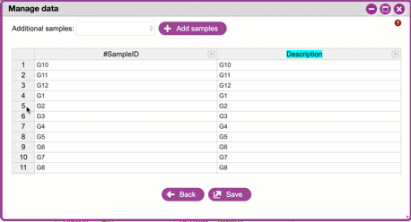
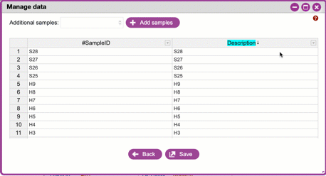
.. |metadata_error| image:: ./img/dna_subway/metadata_error.gif
   :width: 450
   :height: 250
.. |quality_plot| image:: ./img/dna_subway/quality_plot.gif
   :width: 450
   :height: 250
.. |overview_tab| image:: ./img/dna_subway/overview_tab.gif
   :width: 450
   :height: 250
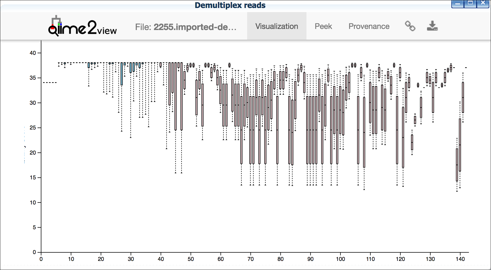
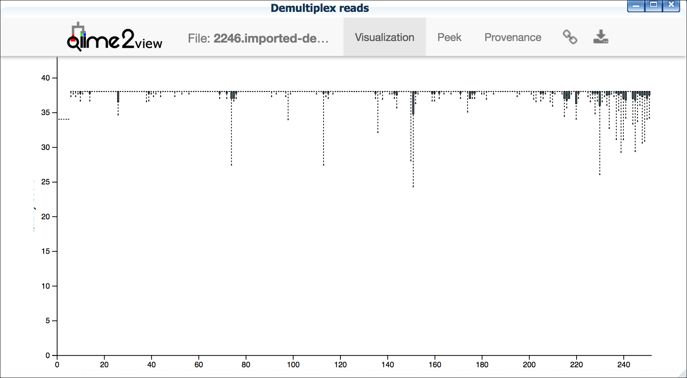
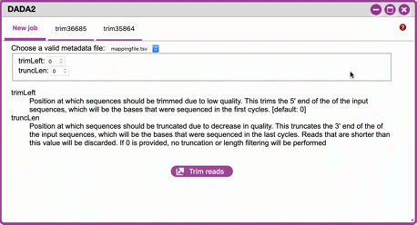
.. |alpha_tabs| image:: ./img/dna_subway/alpha_tabs.gif
   :width: 450
   :height: 250
.. |alpha_plot| image:: ./img/dna_subway/alpha_plot.gif
   :width: 450
   :height: 250
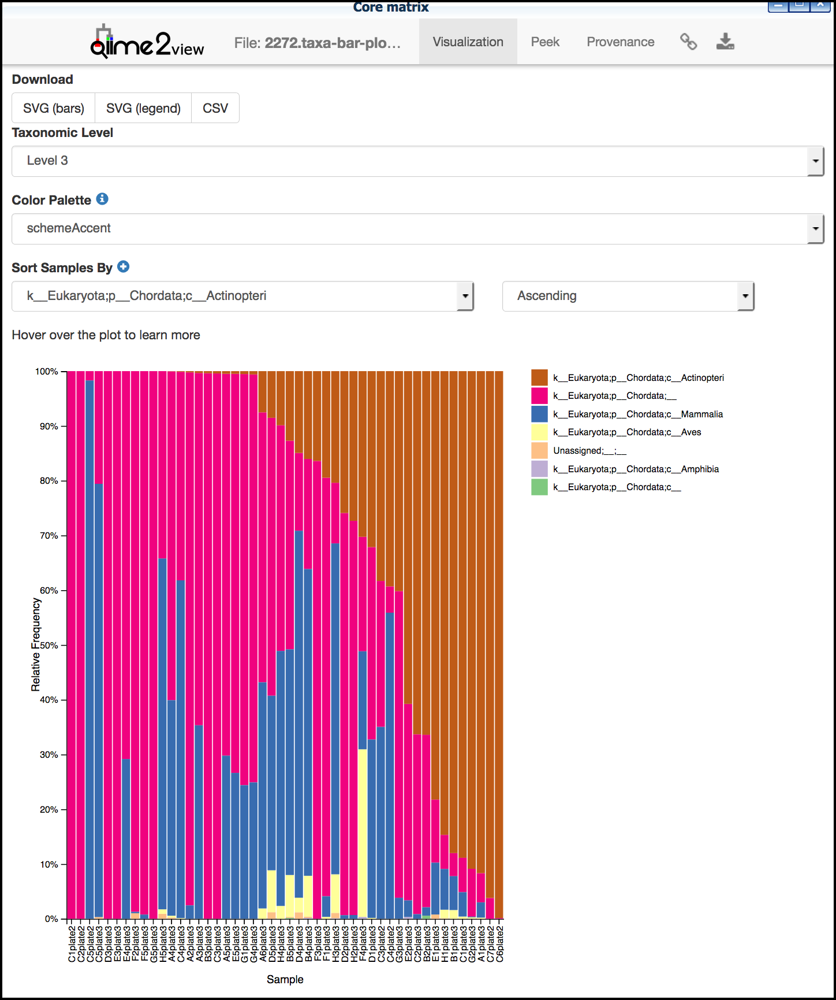
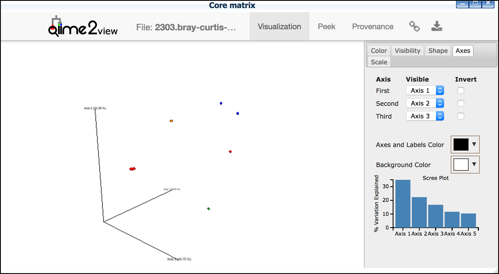
.. |emperor_plots| image:: ./img/dna_subway/emperor_plots.gif
   :width: 550
   :height: 300
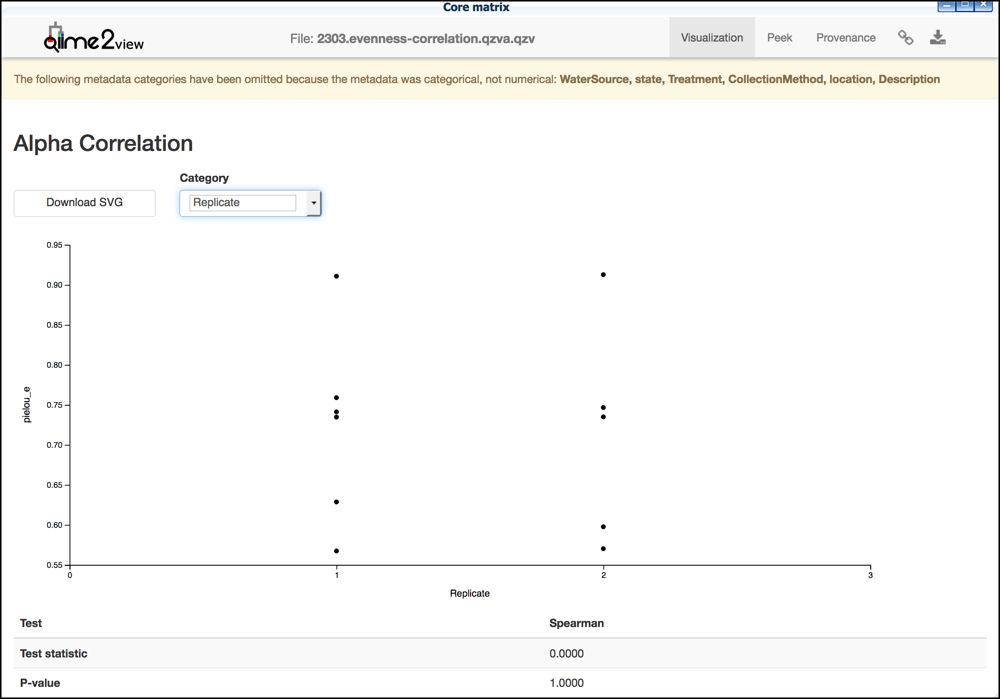
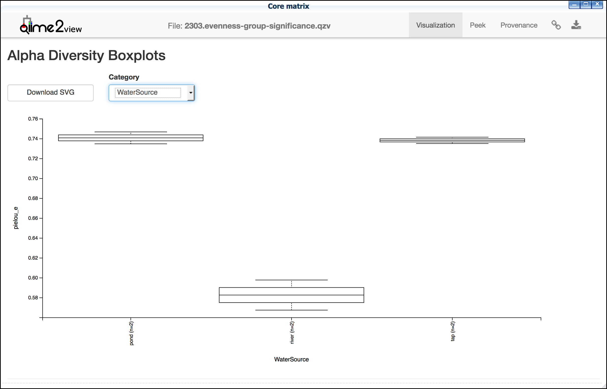
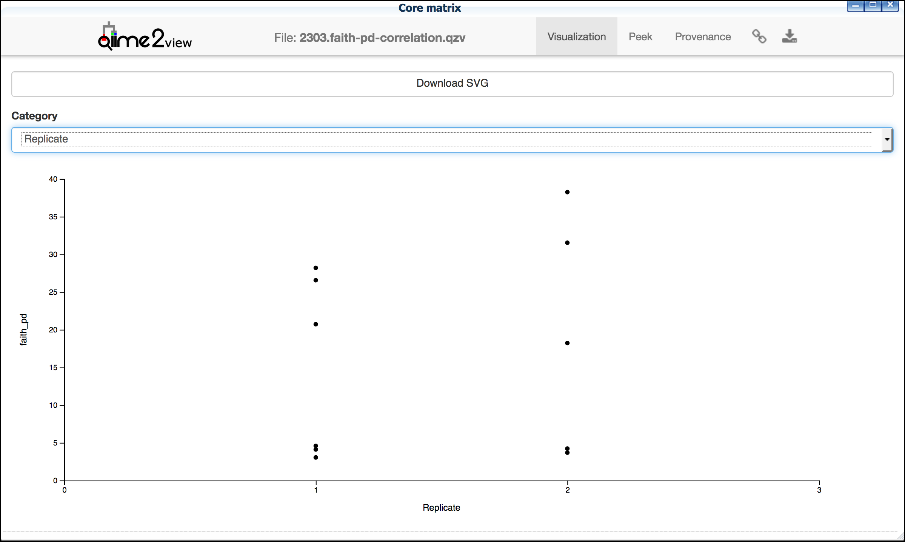
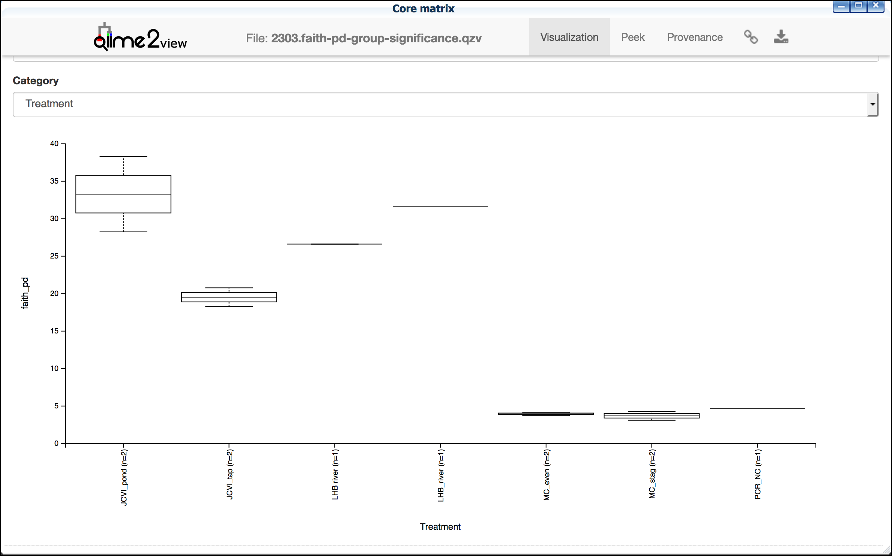
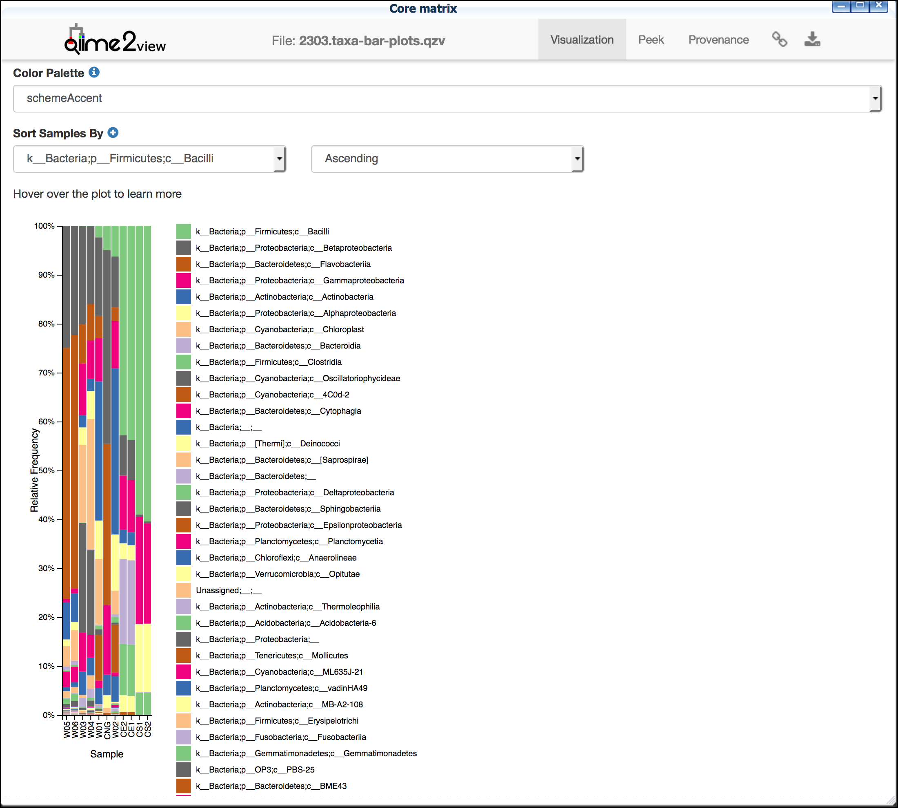
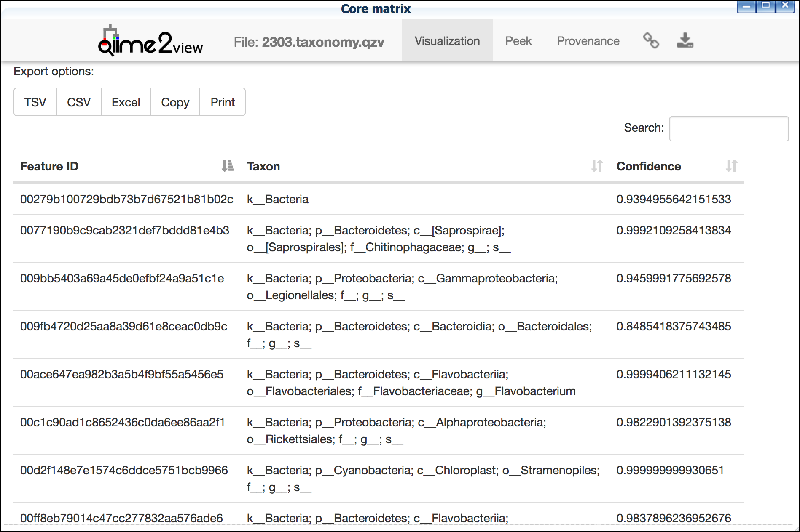
.. |taxonomic_barplots| image:: ./img/dna_subway/taxonomic_barplots.gif
   :width: 550
   :height: 300
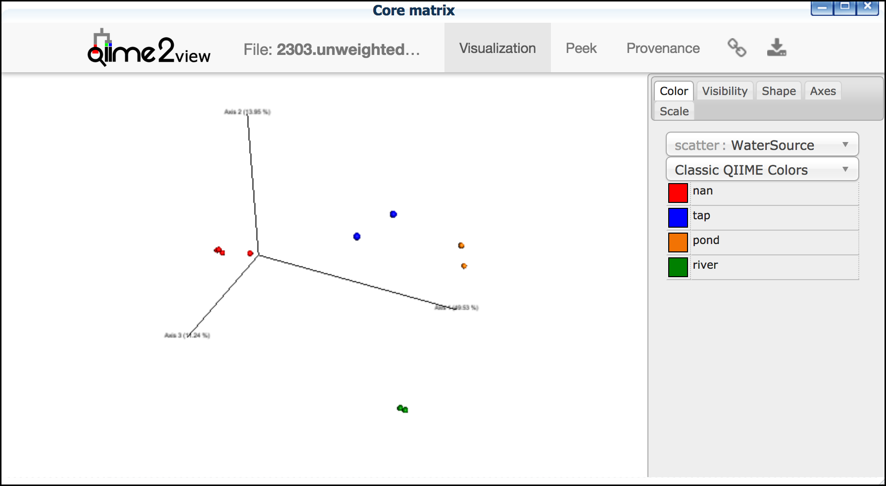

.. |CyVerse User Portal|  raw:: html

  <a href="https://user.cyverse.org" target="_blank">user.cyverse.org</a>

.. |QIIME2 documentation|  raw:: html

  <a href="https://docs.qiime2.org/2018.8/" target="_blank">QIIME 2 documentation</a>

.. |QIIME 2| raw:: html

  <a href="https://qiime2.org/" target="_blank">QIIME 2</a>

.. |QIIME 2 metadata documentation|  raw:: html

  <a href="https://docs.qiime2.org/2019.10/tutorials/metadata/" target="_blank">QIIME 2 metadata documentation</a>

.. |metadata_file| raw:: html

  <a href="http://datacommons.cyverse.org/browse/iplant/home/shared/cyverse_training/platform_guides/dna_subway/purple_line/mappingfile.xlsx" target="_blank">metadata file</a>

.. |Keemei| raw:: html

  <a href="https://keemei.qiime2.org/" target="_blank">Keemei</a>

.. |Illumina Casava 1.8| raw:: html

  <a href="http://illumina.bioinfo.ucr.edu/ht/documentation/data-analysis-docs/CASAVA-FASTQ.pdf/at_download/file" target="_blank">Illumina Casava 1.8</a>

.. |Earth Microbiome Project| raw:: html

  <a href="http://www.earthmicrobiome.org/protocols-and-standards/" target="_blank">Earth Microbiome Project</a>

.. |CyVerse Data Store Guide| raw:: html

  <a href="https://cyverse-data-store-guide.readthedocs-hosted.com/en/latest/step1.html" target="_blank">CyVerse Data Store Guide</a>

.. |view.qiime2.org| raw:: html

  <a href="https://view.qiime2.org" target="_blank">view.qiime2.org</a>

.. |Phred score| raw:: html

  <a href="https://en.wikipedia.org/wiki/Phred_quality_score" target="_blank">Phred score</a>

.. |feature| raw:: html

  <a href="https://forum.qiime2.org/t/what-is-a-feature-exactly/2201" target="_blank">have many meanings</a>

.. |operational taxonomic unit| raw:: html

  <a href="https://en.wikipedia.org/wiki/Operational_taxonomic_unit" target="_blank">operational taxonomic unit</a>

.. |Jaccard| raw:: html

  <a href="https://en.wikipedia.org/wiki/Jaccard_index" target="_blank">Jaccard</a>

.. |principal components| raw:: html

  <a href="https://en.wikipedia.org/wiki/Principal_component_analysis" target="_blank">principal components</a>

.. |UniFrac| raw:: html

  <a href="https://en.wikipedia.org/wiki/UniFrac" target="_blank">UniFrac</a>

.. |Bray-Curtis| raw:: html

  <a href="https://en.wikipedia.org/wiki/Bray%E2%80%93Curtis_dissimilarity" target="_blank">Bray-Curtis</a>

.. |taxonomy overview| raw:: html

  <a href="https://docs.qiime2.org/2019.1/tutorials/overview/#taxonomy" target="_blank">taxonomy overview</a>
